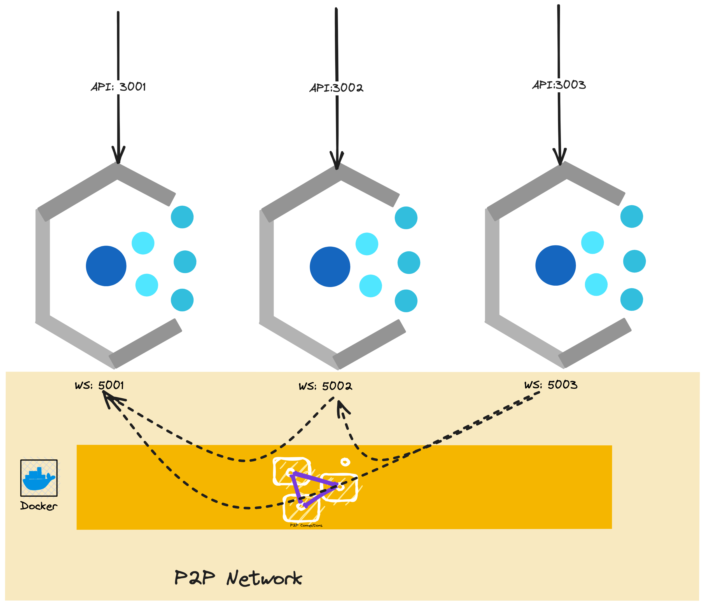

# A simple BlockChain Illustrated

## 1. The main components framework

### API Layer

### Transaction Pool

### Miner

### Blockchain as store

### P2P Communication

## 2. Create a simulated mining network -  running 3 APPs with Docker container

